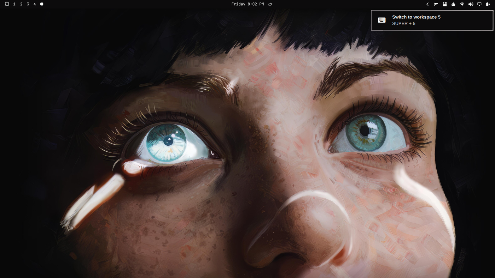
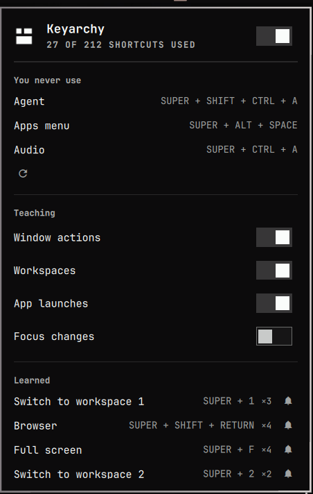

# Keyarchy

Learn Omarchy's keyboard shortcuts as you use your desktop.

-1a1a1a)


[](LICENSE)

Omarchy ships a huge keymap. Most of it stays unused because you already know
how to click.

Keyarchy closes that gap without a cheat sheet. Click a workspace, close a
window, or open an app, and a small reminder shows the binding you could use
next time. Use the keys instead, and it stays quiet.

Each lesson shows at most five times, with a five-minute gap between repeats.
Mute any of them, or turn whole categories off.



Click workspace 5 in the bar, and you'll see:


## Requirements

- Omarchy 4 (`omarchy-shell` / Quickshell) on Hyprland 0.56 — developed against 4.0.2 / 0.56.2
- `~/.config/hypr/hyprland.lua` — the install adds one `require` line to it

## Install

```bash
omarchy plugin add https://github.com/seth-wood/keyarchy.git --enable
~/.config/omarchy/plugins/slw.keyarchy/install-shim.sh
```

Both commands are required. The first installs the shell plugin. The second
installs a small Hyprland Lua shim so Keyarchy can tell a keypress from a
click. Without the shim, reminders stay off.

`install-shim.sh` copies the shim to `~/.config/hypr/keyarchy-shim.lua`, backs
up `hyprland.lua`, adds a `require` line, and reloads Hyprland. It aborts if
Hyprland reports a config error, and is safe to run again.

If you skipped the bar placement prompt: `omarchy plugin enable slw.keyarchy right`.

## Uninstall

```bash
~/.config/omarchy/plugins/slw.keyarchy/uninstall.sh
omarchy plugin remove slw.keyarchy
```

Run `uninstall.sh` first: it is the only thing that takes the shim back out of
`hyprland.lua`, and it stops working once the plugin folder is gone.
`omarchy plugin remove slw.keyarchy` then drops the folder itself. Running
`uninstall.sh` alone is enough — it removes the folder too.

**Removed**

| Path | What it is |
|---|---|
| `~/.config/omarchy/plugins/slw.keyarchy/` | the plugin |
| `~/.config/hypr/keyarchy-shim.lua` | the Hyprland shim |
| the `require("hypr.keyarchy-shim")` line in `~/.config/hypr/hyprland.lua` | and the comment above it |
| the `slw.keyarchy` entry in `~/.config/omarchy/shell.json` | bar placement and settings |
| `$XDG_RUNTIME_DIR/keyarchy/{binds.json,last-bind,last-workspace-intent}` | runtime files, gone at reboot anyway |

**Kept, on purpose**

| Path | What it is |
|---|---|
| `~/.local/state/keyarchy/state.json` | which lessons you have been shown, and when |
| `~/.local/state/keyarchy/usage.json` | how many times you have pressed each shortcut |
| `~/.config/hypr/hyprland.lua.bak.*` | the backups taken before each edit |

Delete them with `rm -rf ~/.local/state/keyarchy` if you want nothing left.
Nothing keeps running after removal: Keyarchy starts no daemon, installs no
service or timer, and grants nothing that needs revoking.

## What it touches

- **No network.** Keyarchy makes no HTTP requests and contacts no service. It
  runs three programs: `hyprctl` (only when the shim is missing), its own two
  helpers in `bin/`, and `omarchy-notification-send` to show a reminder.
- **No elevated privilege.** No `sudo`, no `pkexec`, no systemd units, no
  package installs, and nothing that runs at install time except the two
  scripts you run yourself.
- **`usage.json` is a tally of your keyboard use.** One counter per binding
  description — not keystrokes, not text, but it does say which shortcuts you
  press and how often. `state.json` additionally records workspace names, which
  come from your compositor. Both are `0600` in a `0700` directory and never
  leave the machine.
- **It edits one file you own**: `~/.config/hypr/hyprland.lua`, to add a single
  `require` line, with a backup taken first and an automatic rollback if
  Hyprland reports a config error. It does not touch any other Omarchy or
  Hyprland configuration.

## What it teaches

| You did | It suggests |
|---|---|
| Switched workspace | `Switch to workspace N` |
| Moved a window to a workspace | `Move window to workspace N` |
| Closed a window | `Close window` |
| Went fullscreen | `Full screen` |
| Floated / tiled a window | `Toggle window floating/tiling` |
| Opened a bound app | that app's binding |
| Changed window focus | `Focus on <direction> window` — **off by default** |

Bindings are matched by description, so if you remap `Close window` the
reminder follows your keys.

Focus reminders stay off because focus changes constantly — including when you
open or close a window. Turn them on in the panel if you want them.

Clicks that open the Omarchy menu, launcher, emoji picker, or clipboard from
the bar aren't detected yet. Those are layer-shell surfaces, not regular
windows.

## The bar widget



Left click the mark to open the panel. Right click turns Keyarchy off and on.

The panel keeps score of how much of Omarchy's keymap you actually use, and
surfaces a few unused shortcuts to try (`n` cycles them). Flip reminder
categories on and off, mute a lesson, or reset and start over.

<br clear="all">

## Settings

Settings live in Keyarchy's entry in `~/.config/omarchy/shell.json`. Saving the
file applies them; the panel switches write the same keys.

```jsonc
{
  "plugins": [
    {
      "id": "slw.keyarchy",
      "enabled": true,
      "cooldownMs": 300000,   // don't repeat one lesson inside 5 minutes
      "globalGapMs": 5000,    // never two notifications inside 5 seconds
      "lifetimeCap": 5,       // stop teaching an action after 5 times
      "muted": ["close-window"],
      "categories": {
        "window": true,
        "workspace": true,
        "launch": true,
        "focus": false
      }
    }
  ]
}
```

Lesson history is at `~/.local/state/keyarchy/state.json`. Delete it and run
`omarchy restart shell` to start over.

## How it works

Hyprland's event socket reports what happened, not what caused it. A workspace
change looks the same whether you pressed `SUPER + 5`, clicked the bar, or
focused a window that lived on another workspace (a link that activates a
browser elsewhere).

Omarchy defines its bindings in Lua through `hl.bind`. The shim wraps that
function so each keyboard binding touches a beacon file before running. When a
supported event arrives, Keyarchy waits 250 ms, then checks for a recent
beacon. Find one, and it stays quiet.

Workspace *switches* need one more signal. The shim also wraps `hl.dsp.focus` /
`hl.dispatch` so an intentional `focus({ workspace = N })` (bar click, verify
script) stamps `last-workspace-intent`. Focusing a window does not. Without a
fresh intent, Keyarchy does not teach `Switch to workspace N`. Other lessons
still use the beacon-only rule.

```
keypress ─► hl.bind wrapper ─► touch beacon file ─► original dispatcher
                                    │
                                    ▼ (inotify)
mouse / focus ─► Hyprland socket2 ─► Service.qml ─► beacon recent?
                                                   │ no
                                                   ▼
                                      workspace switch? need intent stamp
                                                   │ ok
                                                   ▼
                                            look up the bind, notify
```

`hyprctl binds -j` reports empty keys for Omarchy's keycode bindings
(workspaces included). The shim sees the original `"SUPER + code:12"` string
at config time and writes `$XDG_RUNTIME_DIR/keyarchy/binds.json`, so reminders
can say `SUPER + 5`.

Those three runtime files decide whether Keyarchy stays quiet and what its
reminders say, so it only accepts them from a runtime directory of the form
`/run/user/<uid>`. There is deliberately no `/tmp` fallback: `/tmp/keyarchy` is
a path another account can create first, and whoever owns that directory owns
the answer. Without a usable runtime directory, Keyarchy stays silent — the
same degraded mode as running without the shim.

Nothing in the shell process opens those files directly. Every read goes
through `bin/keyarchy-file`, which opens the path once with
`O_NOFOLLOW|O_NONBLOCK`, checks on the descriptor it actually got that the
thing it opened is a regular file this user owns, and reads at most 64 KiB
before refusing. `FileView` is used only to watch for changes. That is what
keeps a symlink or a FIFO planted on one of these names from redirecting a
read or hanging `omarchy-shell`, which hosts every widget on the bar.

## Development

```bash
git clone https://github.com/seth-wood/keyarchy.git
cd keyarchy
./install.sh           # copies the tracked files into the plugin folder, then the shim
omarchy restart shell  # a service plugin is only mounted at shell startup
```

The repository root *is* the plugin folder. `omarchy plugin add` clones it into
`~/.config/omarchy/plugins/slw.keyarchy/`. For local work, `./install.sh` copies
your checkout there — the registry doesn't accept symlinks, so re-run it after
edits, then restart the shell.

```
manifest.json          kinds: service + bar-widget, id slw.keyarchy
Service.qml            wiring: Hyprland events, file watches, notifications
KeyarchyPanel.qml      the bar widget and its popup
KeyarchyMark.qml       the mark drawn on the bar
ShortcutRow.qml        one "action -> keystroke" line
KeyarchyModel.js       all the logic, no QML imports, unit tested
BoundedFile.qml        one watched file, read through the helper below
bin/
  keyarchy-file        descriptor-bound reader/writer for the five files
  keyarchy-bounded     runs a command with a byte cap and a deadline
hypr/
  keyarchy-shim.lua    the hl.bind wrapper
test/
  model.test.mjs       node --test test/model.test.mjs
  shim.test.lua        lua test/shim.test.lua — mocks hl, no compositor needed
```

- **Quickshell connects the Hyprland event socket lazily.** A bare
  `Connections { target: Hyprland }` in a headless service never fires.
  `Service.qml` touches `Hyprland.workspaces` at startup to force the
  connection. Remove that line and events stop with no error.
- **Editing the repo does not update the installed plugin.** Re-run
  `./install.sh`, then `omarchy restart shell`. `omarchy plugin enable` mid-
  session is not enough on a first install.
- **Deleting `state.json` needs a shell restart.** The running service holds
  lesson history in memory and only reads the file at startup.
- **Do not name a plugin file after the type it extends.** A local `Panel.qml`
  shadows `qs.Ui.Panel`. The entry point is `KeyarchyPanel.qml` for that reason.
- **A bar widget needs `implicitWidth`/`implicitHeight`.** Without them it
  occupies a zero-width slot and renders nothing, with no error.
- `omarchy plugin enable <id> <section>` will not move a plugin that is already
  enabled. Disable it first, then enable it with the placement.
- Omarchy 4 dispatches in Lua, so testing by hand means
  `hyprctl dispatch "hl.dsp.focus({ workspace = '5' })"`, not
  `hyprctl dispatch workspace 5`. The old syntax fails silently.

## Caveats

- **The shim wraps keyboard bindings registered through `hl.bind`.**
  `test/shim.test.lua` checks that return values, dispatchers, and arguments
  are preserved, mouse bindings are left alone, and reloading doesn't wrap
  twice. Run it before installing any change to the shim.
- `hl.bind` and `hl.dsp` are **undocumented** Omarchy 4 internals. If an update
  changes them, the shim may stop updating the beacon and reminders may stop.
  It should not break Hyprland — the shim no-ops when `hl.bind` is missing —
  but check after an update.
- Mouse bindings (`SUPER` + drag) are deliberately not wrapped; a Lua callback
  would swallow the press/release semantics that drag-to-move depends on.
- Web app bindings, such as ChatGPT and Email, are not detected yet. They open
  as generic Chromium classes that need URL matching to tell apart.

## License

MIT — see [LICENSE](LICENSE).
